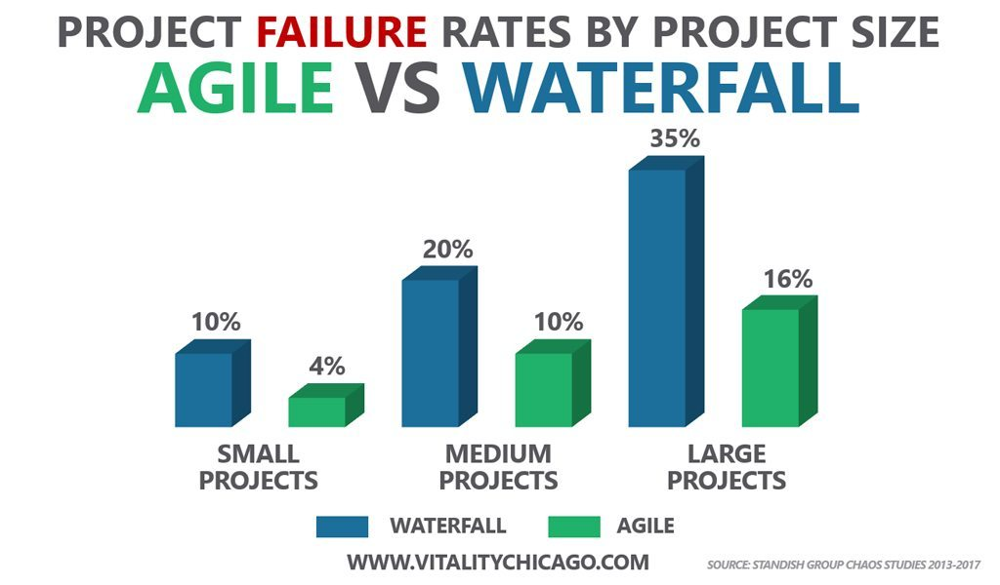
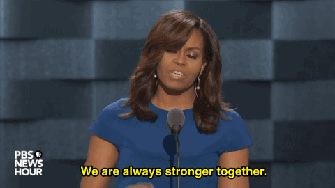
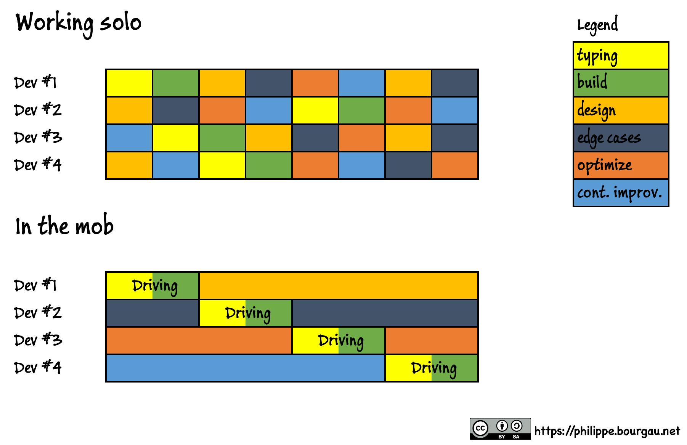
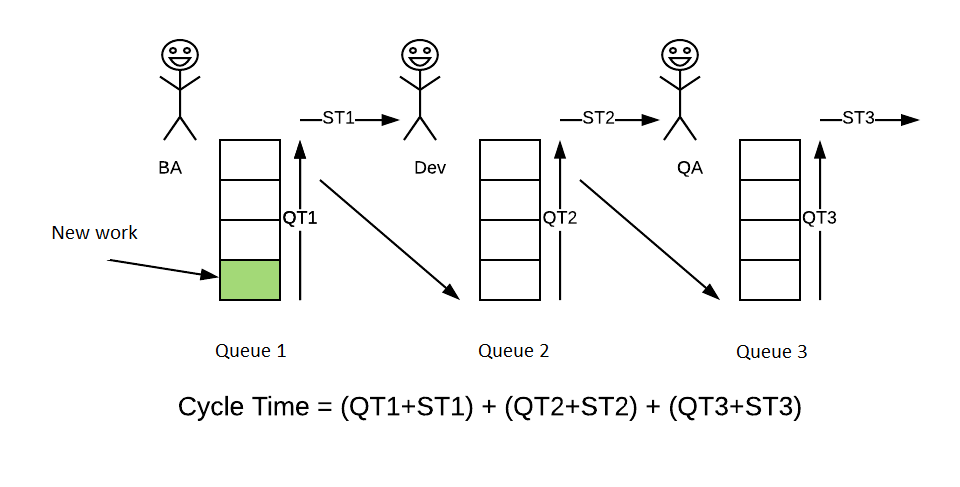
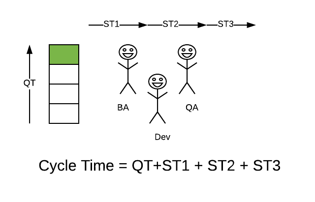

# Vom Fließbandarbeiter zum NavySeal 
<i class="fa fa-user"></i>&nbsp;Daniel Hörner

<--->
## Der Wasserfall

Note:
- Das klassische Vorgehen
- extrem auf mehrere Jahre vor und durch geplant
- veränderungen im Plan sind extrem schwierig umzusetzen

<-->

Note:
- Modern Times von Charly Chaplin (1936), erstaunlich scharf analysiert
- Architekt hat das Fließband wir nennen es Framework, gebaut
- Anforderungen kommen rein
- Spezialisierte Entwickler (Frontend, Backend, Datenbank)
- Entwickler implementieren ohne Tests und ohne zu hinterfragen, mit eingeschränkten skills
- Produkt läuft von Station zu Station

<--->
## Time to market 

Note:
- Änderungen sind teuer
- möglichst wenig anpassen
- technologien möglicherweise veraltet
- hohe Unsicherheit bei neuen Projekten
- schwierige Anpassbarkeit (siehe Charlie Chaplin als er weiter schraubt)

<--->
## 
agile

transition

Note:
- Agiles Manifest
 - Menschen und Interaktionen stehen über Prozessen und Werkzeugen
 - Funktionierende Software steht über einer umfassenden Dokumentation
 - Zusammenarbeit mit dem Kunden steht über der Vertragsverhandlung
 - Reagieren auf Veränderung steht über dem Befolgen eines Plans
  - Fail Fast ist das Thema, oft lügt man gerade hier weil man mikroänderungen macht, aber sicht nicht an den gesamt Scope traut

<-->

Note:
- Erstaunlich gerade großen Projekten traut man Agilität nicht zu (ROBASO BA 60MIO, nach 5 Jahren Pilotphase, Grund nicht Agil)
- Agile projects are 28% more successful than traditional projects. (Source: PwC)

<-->
> "... nur 9 Prozent vollständig ohne Linienaufgaben und organisieren sich in Squads, Tribes und Chapters komplett selbst." (Kienbaum - 18.12.2018 )

<--->

## Water Scrum Fall

<-->

Note:
- Viele Baustellen werden aufgerissen
- Wenige Baustellen werden geschlossen
- 'Unser Backlog ist für die nächsten 9 Monate vorgeschätzt'
- Komponenten Teams statt feature Teams
- Horizontale statt vertikale Entwicklung
- Trennung von Datenbank, Backend, Frontend

<--->

## 
Navy

SEAL

Note:
- Schauen wir uns mal ein Squad Navy Seals an und wie das ungefähr bei denen so läuft und ziehen vergleiche zu Scrum
- Jeff Sutherland, der Erfinder von Scrum war ein Top Gun Pilot und Ausbilder
- IT und Militär sind in den USA viel stärker verwachsen

<-->
## Sea, Air, Land

Note:
- Crossfunktional

<-->
## 
Cross

Functional

Note:
Entwicklungsteams weisen die folgenden Eigenschaften auf:
- Sie sind selbstorganisierend.
- Niemand sagt dem Entwicklungsteam, wie es Funktionalität erzeugen soll. ==> kein Übergeordnetes Design (UX/ Architektur/ EntwicklerAdel)
- Entwicklungsteams sind interdisziplinär. ==> Mob Programming
- Alle Fähigkeiten um ein Produktinkrement zu erstellen. ==> Ops
- Mitglieder haben keine Titel. unabhängig von der Arbeit. ==> Uxler
- Keine weiteren Unterteilungen innerhalb des Entwicklungsteams, ungeachtet der verschiedenen Themenfelder, mit denen das Team sich befasst, also z.B. "Test", "Architektur", "Betrieb" oder "Analyse". ==> Mob Programming
- Einzelne Mitglieder des Entwicklungsteams können zwar spezialisierte Fähigkeiten oder Spezialgebiete haben, aber die Rechenschaftspflicht obliegt dem Team als Ganzem.

Ergebnis:
- Entwickler, Tester, Architekten, REler und UXler werden wild zusammengewürfelt
- Produktion / Betrieb bleibt aber außen vor

<-->

Note:
- Für die Entwickler fühlt es sich so an
- WIP Limit einführen

<--->

### Team-Kultur

<-->
> 50% of team members are motivated more byteam success
than by the company’s 27% or individual’s 23% personal goals. (Source: Atlassian)

<--->

Note:
- Wie werden wir Navy SEALs
- Wie hilft uns Scrum und Software Craftmanship

<--->
## 
Was?

Wie?

Note:
- Einem SEALTeam wird das Was vorgeschrieben:
- befreit die Geiseln
- Einem SealTeam wird das Wie vorgeschrieben:
- Wir fahren zu EinsatzOrt mit einem Panzer, weil wir das schon immer so gemacht haben, (obwohl das Versteck in einer kleinen verwinkelten Straße ist) => Schwergewichtige Unternehmensframeworks
- Geisel ist im 4 Stock (eigentlich ist sie aber im 2)
- Erschiese die drei Geiselnehmer in der Küche (eigentlich sind da die Geiseln und im 4 Stock eine Familie)
<-->
## 
Inspect

+ Adapt

<-->

<--->
## 
Scrum

Values

Note:
- Also wie ist denn die Scrum Kultur so

<--->
### Courage  

Note:
- Dev Team bestimmt das WIE
- Definition of Ready einfordern (das WAS, einfach INVEST)
- Nicht auf 'Auslastung' arbeiten
- fail fast
- inpsect and adept

<-->
>"It is better for the devs to be 🏄 than writing code that won´t be nedded"
(Dr. Jeff Sutherland )

<--->
### Focus

Note:
- TDD
- Komplexität reduzieren
- BoyScout Pattern

<-->
> Stop Starting 
> Start Finishing

Note:
- Fangt nix an, was ihr nicht zu Ende bringen könnt

<--->
### Commit ment

Note:
- Löwenmama (Scrum Master fürs TEam, Team fürs Produkt)

<-->

Note:
- DOR und DOD
- INVEST (Unabhängig, verhandelbar, wertvoll, schätzbar, klein, testbar)
<--->
### Respect

<-->

Note:
- Hochstapler-Syndrom
- DIE Entwickler, DIE Admins, DIE ...

<--->
### Openness

Note:
- Benennt die Dinge wie sie sind, belügt euch nicht selber (ScrumBut, )
- Kommuniziert offen, schluckt nichts herunter
- Gerade das Management muss mit dieser neuen Offenheit umgehen lernen
- Seid einfach Transparent

<-->

Note:
- Lernt neue Dinge, stetige Weiterbildung
- inspect and adept 

<--->

## Software Crafting

<--->

## Continuous Delivery
Continuous Integration

<-->

### 
Write

Tests

Note:
- Ohne Tests keine CD

<-->
### Unit, Integration, Acceptance
 
Note:
- Die Basis ist immer Unit Tests und ein gute Mocking Framework
- Ausreichende UnitTestabdeckung beginnt ab 90 %, 95% gut
- in einem MOB eignet sich gerade BDD hervoragend, da so eine Living Documentation ensteht (SPOCK im Java / Spring BootUmfeld zB)
 
<--->
## 
Mob

Programming

Note:
- Das ganze Team ist beteiligt, also nicht iterativer Wasserfall
- Immernoch selten verwendet, wie auch beim Code Retreat erfahren
- Wissen wird verteilt
- implizite Code Reviews
- Schafft vertrauen
- stärkt und schärft die Kommunikation im Team 
- Keine Kontext veränderung
- reduzierte Komplexität da nur implementiert wird, was unbedingt gebraucht wird und implementierungs Hindernisse durch Architektur sichtbar werden
- Keine Übergaben (Ticketpipeline)
- Keine Frage und Antwort verzögerung im Team
- Stärkung von crossfunktionaler Flexibilität
- Hohe Qualität, da jeder Mitdenkt
- Kein Aufwändiges Queue Task Management

<-->
<!-- .slide: class="outline" data-background-image="resources/mob.jpg" data-background-size="cover" data-state="dimmed-less"-->

Note:
- Nicht die sondern Wir
- Stärkt commitment zum Produkt, da man an jeder Phase beteiligt ist
- Nicht zu codieren ist arrogant und nicht respekt
- Nicht ganz 100 % dabei, der PO und der Scrum Master (impediments bezeichnen)
   
<-->
[penny_game](https://www.youtube.com/watch?v=SumHmhjFMWM)
<-->

- Der Mob schafft Mut innovativ zu sein und sich gemeinsam zu entwickeln
- Er stellt sicher das der Fokus stets auf dem Wichtigen liegt
- Der Mob teilt Verantwortung, Rückschläge und Erfolge auf
- Es entsteht eine Atmosphäre aus Respekt und Transparenz

Note:
- Fokus keine verkünstelungen von Architektur und Code durch REs Leute im Team
- Fokusierte Fachlichkeit durch Entwickler und Uxler im Team
- Erfolg des Teams am wichtigsten
- No Kanban Queue
- Keine Schuldfrage oder abschieben

<-->

<-->

Note:
- Das ist jetzt wieder das Beispiel aus dem Wasserfall oder iterativen Wasserfall

<-->

<-->
### More Facts
 - Code Base min 10% kleiner
 - Mobs reagieren allergisch auf technische Schulden
 - 5.83% mehr Durchsatz ([Rule of 70](https://philippe.bourgau.net/3-long-term-benefits-of-mob-programming-that-make-it-cost-effective/))

<--->

## Become a mob
 - Remote Mob Programming Coaching (Kurs Nr. 46116)
 - Workshop von Null auf Prod mit Community Pipeline (Team Enablement)

<--->
## MUCHO MERCI

thxs:
- prototypr.io (Lea Kovac Beckman )
- scrum.org (ILLIA Pavlichenko, )
