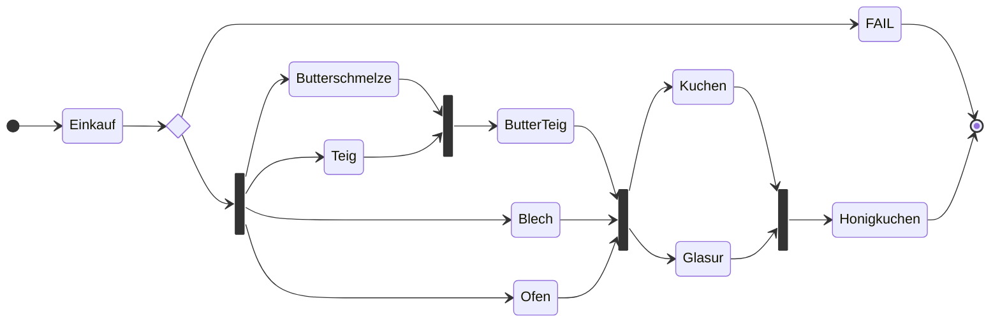

---
# try also 'default' to start simple
theme: datev-scc
class: 'text-center'
lineNumbers: false
info: |
  ## Slidev Starter Template
  Presentation slides for developers.

  Learn more at [Sli.dev](https://sli.dev)
download: true
drawings:
  persist: false
---

# <span class="simple animated-header-text">Modernes reaktives Spring-Boot</span> 
<carbon-user/> Daniel Hörner,
<carbon-user/> Christoph Welcz,
<carbon-user/> Valentin Petras

<carbon-link /> [schlammspringer.github.io/modern-springboot-with-kotlin]([https://schlammspringer.github.io/modern-springboot-with-kotlin])

<v-card githubUrl="https://github.com/SchlammSpringer/modern-springboot-with-kotlin" />

---
layout: banner
main: Motivation
---

---
class: fade
---

<v-clicks>

- Anzeige von Liquiditätsinformationen
- Sammeln und Aggregieren von Daten aus unterschiedlichen Quellen
- Erste produktive App in Kotlin

</v-clicks>

---
layout: banner
main: Reactive
sub: Coding
---

---
layout: quote
author: Spring Resttemplate Doc
link: https://docs.spring.io/spring-framework/docs/current/javadoc-api/org/springframework/web/client/RestTemplate.html
---
As of 5.0 this class is in maintenance mode, [...]. Please, consider using the [...].reactive.client.WebClient which has a more modern API and supports sync, async, and streaming scenarios.

---
layout: banner
main: Better
sub: Performance
---

---
layout: quote
---

... Spring Webflux with WebClient and Apache clients wins in all cases. The most significant difference (4 times faster than blocking Servlet) when underlying service is slow (500ms).

<!--
- economic & ecologic benefits
-->

---

# Laufzeitentkopplung

```kotlin
@PutMapping(...)
suspend fun upload(@RequestBody uploaded: Flow<Item>): String {
  val list = uploaded.toList()
  // this runs in background
  CoroutineScope(Dispatchers.IO).launch {
    collector.collect(list)
  }
  // immediately returned
  return "🤞"
}
```

<v-click>

```java
@PutMapping(...)
public Mono<String> upload(@RequestBody Flux<Item> uploaded) {
  // this runs in background
  uploaded.collectList()
          .publishOn(Schedulers.elastic())
          .doOnSuccess(collector::collect)
          .then()
          // Monos are cold!
          .subscribe();
  // immediately returned
  return Mono.just("🤞");
}
```

</v-click>

---

# Parallelisierung von Aufrufen

```kotlin
= coroutineScope {
  // pseudo-imperative style
  val accountsFromA = async { 
    readAccountsByApiFromDomainA(consultant, client) 
  }
  val accountsFromB = async { 
    readAccountsByApiFromDomainB(consultant, client) 
  }
  combineAccounts(accountsFromA.await(), accountsFromB.await())
}
```

<v-click>

```java
  // Functional Reactive Programming
  return readAccountsByApiFromDomainA(consultant, client)
    .collectList()
    .publishOn(Schedulers.elastic())
    .zipWith(
      readAccountsByApiFromDomainB(consultant, client)
        .collectList()
        .publishOn(Schedulers.elastic()), 
      (accountsFromA, accountsFromB) -> 
        combineAccounts(accountsFromA, accountsFromB)
    );
```

</v-click>

---
layout: banner
main: Kotlin
sub: Coroutines
---

---
class: fade
---

<v-clicks>

- Superset von `async`/`await`
- Programmieren im gewohnten imperativen Stil
- Einbetten aller Objekte in `Mono` nicht nötig!
- Einheitliche Programmierung über Stacks (RxJava, Project Reactor, Android) hinweg

</v-clicks>

---

```kotlin
fun main() = runBlocking {
  repeat(100_000) { // launch a lot of coroutines
    launch {
      delay(5000L)
      print(".")
    }
  }
}
```

---

```kotlin
fun main() = runBlocking {
    doWorld()
}

suspend fun doWorld() = coroutineScope {  // this: CoroutineScope
    launch {
        delay(1000L)
        println("World!")
    }
    println("Hello")
}
```
---
layout: banner
main: Framework
sub: vs. Domain
---
# Trennung Framework- / Business-code 
---

## In der Weihnachtsbäckerei


---


## Business Code portabel und wiederverwendbar
  
```kotlin {all|1,2,17|4-16}
fun backeHonigkuchen(vorhandeneZutaten: Zutaten) = 
  mono {
    // Businesscode wiederverwendbar und portierbar auf android, quarkus, liberty, aws lamba, node.js, usw.
    val zutaten = einkaufen(vorhandeneZutaten)

    val butterschmelze = async { honigMitButterSchmelzen(zutaten.honig, zutaten.butter) }
    val teig = async { teigVorbereiten(zutaten.mehl) }
    val blech = async { blechEinbuttern(zutaten.butter) }
    val ofen = async { ofenVorheizen() }

    val butterTeig = async { schmelzeInTeigRuehren(butterschmelze.await(), teig.await()) }

    val kuchen = async { backen(ofen.await(), butterTeig.await(), blech.await()) }
    val glasur = async { glasurVorbereiten(zutaten.zucker) }

    Honigkuchen(kuchen.await(), glasur.await())
  }
```
---

## Business und Framework Code stark verwoben

```java {all|1,3,4,9,12-14,15-18,19,20,25|2,5-8,10-11,21-23}
public Mono<Honigkuchen> backeHonigkuchen(Zutaten vorhandeneZutaten) {
  return einkaufen(vorhandeneZutaten)
      .zipWhen(
          zutaten -> zip(
              honigMitButterSchmelzen(zutaten.getHonig(), zutaten.getButter()),
              teigVorbereiten(zutaten.getMehl()),
              blechEinbuttern(zutaten.getMehl()),
              ofenVorheizen()
          ).zipWhen(
              schmelzeTeigBlechOfen -> schmelzeInTeigRuehren(
                  schmelzeTeigBlechOfen.getT1(), schmelzeTeigBlechOfen.getT2()),
              (schmelzeTeigBlechOfen, butterTeig) -> { //Tuple of Tuple deconstruction via BiFunction
                return of(butterTeig, schmelzeTeigBlechOfen.getT3(), schmelzeTeigBlechOfen.getT4());
              }),
          (zutaten, butterTeigBlechOfen) -> { //Tuple of Tuple deconstruction via BiFunction
            return of(
                zutaten, butterTeigBlechOfen.getT1(), butterTeigBlechOfen.getT2(), butterTeigBlechOfen.getT3());
          }
      ).zipWhen(
            vorbereitungen -> zip(
                glasurVorbereiten(vorbereitungen.getT1().getZucker()),
                backen(vorbereitungen.getT2(), vorbereitungen.getT3(), vorbereitungen.getT4())),
            (vorbereitungen, kuchenGlasur) -> new Honigkuchen(kuchenGlasur.getT1(), kuchenGlasur.getT2())
        );
}
```

---
layout: banner
main: Data
sub: Classes
---
# Data Classses
---

## Weniger Boilerplate

```kotlin
data class Account(
  val id: ObjectId? = null,
  val consultantNumber: Long,
  val clientNumber: Long,
  val name: String,
  val iban: String,
)
```

---

## Immutability vermeidet Race Conditions

```kotlin
val account = Account(...)
account = Account(...) // does not compile!
account.name = "New Name" // does not compile!
// mutable property 
var account = Account(...)
// clone property with only a few new informations
val changedAccount = account.copy(name = "New Name")
```

<!--
`copy` ist der idiomatische Weg!
-->

---

## API Design mit Immutability und expliziten Null Checks für Pflichtfelder 

```kotlin
val account = Account(
  consultantNumber = 123, 
  clientNumber = 456, 
  // does not compile!
  name = null, 
  iban = "DE12345678",
  )

// id is nullable, does not compile!
account.id.toString()
account.id?.toString() ?: "Not available"
```

---
layout: banner
main: list
sub: functions
---
# Arbeiten mit Listen
---

```json {all|3,5}
{
  "dailyBalances": [
    { "iBAN": "DE123", "day": "2021-05-03", "total": "1234.12" },
    { "iBAN": "DE123", "day": "2021-05-02", "total": "500.12" },
    { "iBAN": "DE987", "day": "2021-05-05", "total": "600.88" },
    { "iBAN": "DE987", "day": "2021-05-01", "total": "145.23" }
  ]
}
```

Tagessalden aller Konten -> aktueller Kontostand 1835.00

---

## `for each` Kaskade

```java
// Ermittlung Gesamtbetrag aller Konten auf Basis der Tagessalden
public BigDecimal sumLatestTotalsByIban(List<DailyBalance> dailyBalances) {
  var acc = BigDecimal.ZERO;
  var balancesGroupedByIban = new HashMap<String, List<DailyBalance>>();
  for (var balance : dailyBalances) {
    balancesGroupedByIban
        .computeIfAbsent(balance.getIban(), k -> new ArrayList<>())
        .add(balance);
  }
  for (var balances : balancesGroupedByIban.values()) {
    DailyBalance latestDailyBalance = null;
    for (var balance : balances) {
      if (latestDailyBalance == null) {
        latestDailyBalance = balance;
      }
      else if (balance.getDay().isAfter(latestDailyBalance.getDay())) {
        latestDailyBalance = balance;
      }
    }
    var total = Objects.requireNonNull(latestDailyBalance).getTotal();
    acc = acc.add(total);
  }
  return acc;
}
```

---

## STREAMing API

```java {all|4,7,9,11}
// Ermittlung Gesamtbetrag aller Konten auf Basis der Tagessalden
public BigDecimal sumLatestTotalsByIban(List<DailyBalance> dailyBalances) {
  return dailyBalances
      .stream()
      .collect(groupingBy(DailyBalance::getIban))
      .values()
      .stream()
      .flatMap(balances -> balances
                                   .stream()
                                   .max(comparing(DailyBalance::getDay))
                                   .stream())
      .map(DailyBalance::getTotal)
      .reduce(BigDecimal.ZERO, BigDecimal::add);
}
```

---

## Berechnungen innerhalb 

statt Delegation an `Stream.collect` und `Stream.reduce`

```kotlin
// Ermittlung Gesamtbetrag aller Konten auf Basis der Tagessalden
fun List<DailyBalance>.sumLatestTotalsByIban() = groupBy { it.iban }
    .map { it.value.maxByOrNull { it.day } }
    .sumOf { it!!.total }
```

---

## Sehr mächtige API Funktionen 

statt Java `for each` Kaskade

```kotlin
// Relative Veränderung des Kontostands mit Startsaldo
fun List<BigDecimal>.convertAbsolutesToDeltas(totalStart: BigDecimal) =
  // ergänzt Salden um Startsaldo
  (listOf(totalStart) + this) 
    // bildet WertPaare
    // berechnet Delta aus vorherigen und aktuellen Wert 
    .zipWithNext { current, next -> next - current } 

// Absolute Veränderung des Kontostands mit Startsaldo
fun List<BigDecimal>.convertDeltasToAbsolutes(totalStart: BigDecimal) =
  // addiert den vorherigen Wert auf den aktuellen auf
  runningReduce { previous, current -> current + previous } 
  // absoluten Anfangswert aufaddieren
  .map { it + totalStart } 
```

---
layout: banner
main: kotlin
sub: language
---

---

# Expression functions für weniger Boilerplate

```kotlin
// block body
fun helloWorld(): String {
  return "Hello World"
}

// expression with type inference
fun helloWorld() = "Hello World"

```

<!--
- weniger refactoring pain durch type inference bei Änderung von Rückgabewerten
-->

---

# Domain Language durch Extension functions

```kotlin
private fun BigDecimal.toEuroCent() = 
  multiply(BigDecimal(100)).toLong()

val total = (value1 - value2).toEuroCent()
```

<v-click>

```java
private long toEuroCent(BigDecimal value) {
  return value.multiply(new BigDecimal(100)).longValue();
}

var total = toEuroCent(value1.subtract(value2));
```

</v-click>

<!--
- Kotlin Listen Funktionen sind alles extension functions
-->

---
layout: banner
main: kotest
sub: testing
---

---

# BDD Strukturierung der Tests

```kotlin
describe("API for Payment Plan") {
  describe("has POST") {
    it("returns new plan") {...}

    it("rejects new plan with wrong identifier") {...}
  }

  describe("has GET") {...}

  describe("has PUT {id}") {...}

  describe("has DELETE {id}") {...}
}
```

---

# höhere Konfidenz 

durch Property Based Testing

```log
Property failed after 671 attempts
Arg 0: (1980-11-29, 1972-10-30..2007-09-27)
Arg 1: Step(width=1, unit=Months)
Repeat this test by using seed 6737234594828379639
Caused by: 97 elements passed but expected 98
The following elements passed:
1972-10-30
1972-11-30
1972-12-30
1973-01-30
1973-02-28
1973-03-30
1973-04-30
1973-05-30
1973-06-30
1973-07-30
... and 87 more passed elements
The following elements failed:
1980-11-30 => 1980-11-30 should be <= 1980-11-29
```

---

```kotlin
it("supports a pre-emptive end") {
  val endBeforeRangeEnd = arbDateAndRange.filter { (end, range) -> 
    range.contains(end) && end < range.endInclusive 
  }
  checkAll(endBeforeRangeEnd, arbStep) { (end, range), step ->
    range.temporalSequence(step, range.startInclusive, end).forAll {
      it shouldBeLessThanOrEqualTo end
    }
  }
}
```

---

# Kotest Generatoren für Property Tests

```kotlin
it("functions are isomorphic") {
  checkAll(Arb.bigDecimal(), Arb.list(Arb.bigDecimal())) { total, list ->
    list.convertDeltasToAbsolutes(total).convertAbsolutesToDeltas(total) 
        shouldEqualIgnoringTrailingZeros list
    list.convertAbsolutesToDeltas(total).convertDeltasToAbsolutes(total) 
        shouldEqualIgnoringTrailingZeros list
  }
}
```

---
layout: banner
main: fazit
---

---
layout: cover
class: text-4xl
---

Wir wollen nicht mehr zurück nach Java 😉

---
layout: cover
---

[schlammspringer.github.io/modern-springboot-with-kotlin](https://schlammspringer.github.io/modern-springboot-with-kotlin)

- <cite>[Spring Boot Kotlin](https://spring.io/guides/tutorials/spring-boot-kotlin/)</cite>
- <cite>[Höherer Durchsatz als Spring](https://medium.com/@filia.aleks/microservice-performance-battle-spring-mvc-vs-webflux-80d39fd81bf0)</cite>
- <cite>[Example from Kotlin Guide to Coroutines](https://github.com/Kotlin/kotlinx.coroutines/blob/master/kotlinx-coroutines-core/jvm/test/guide/example-basic-06.kt)</cite>
- <cite>[Flux 3 - Hopping Threads and Schedulers](https://spring.io/blog/2019/12/13/flight-of-the-flux-3-hopping-threads-and-schedulers)</cite>
- <cite>[Spring, Coroutines and Kotlin Flow](https://spring.io/blog/2019/04/12/going-reactive-with-spring-coroutines-and-kotlin-flow)</cite>
- <cite>[Kotest Generators](https://kotest.io/docs/proptest/property-test-generators.html#arbitrary)</cite>
- <cite>[Kotest](https://kotest.io/)</cite>
- <cite>[MockK - Mocking Library für Kotlin inkl. Coroutinen](https://mockk.io/)</cite>
